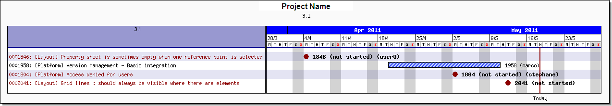
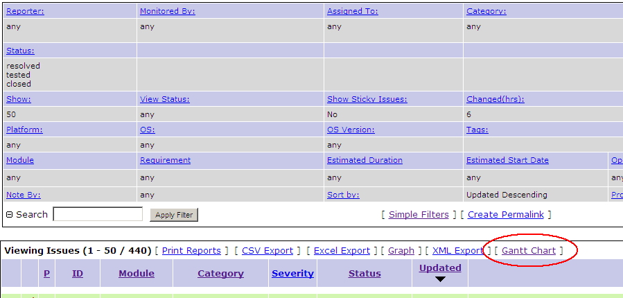
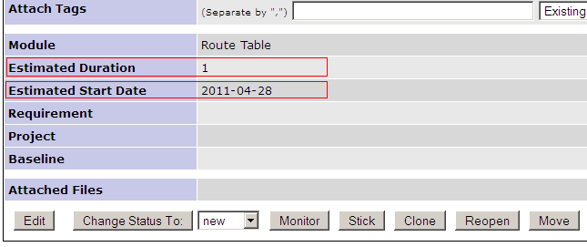
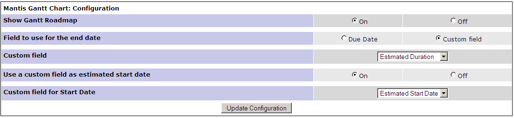
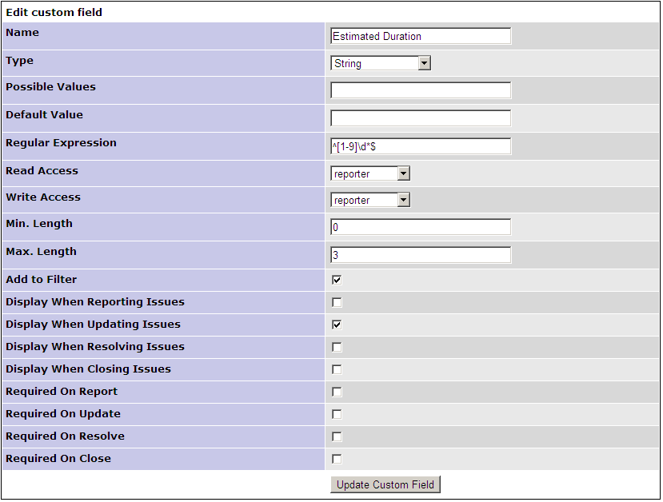

# GanttChart MantisBT Plugin

- [GanttChart MantisBT Plugin](#GanttChart-MantisBT-Plugin)
  - [Description](#Description)
  - [Installation](#Installation)
  - [Requirements](#Requirements)
  - [Issues and Feature Requests](#Issues-and-Feature-Requests)
  - [Usage](#Usage)
  - [Configuration](#Configuration)
  - [MantisBT Patches](#MantisBT-Patches)
  - [Authors of Original Code Base](#Authors-of-Original-Code-Base)

## Description

This plugin is a updated version of the previous GanttChart plugin that has been unmaintained for over 5 years (as of 2019).

This plugin was developed and tested on MantisBT 2.21.1.

## Installation

Extract the release archive to the MantisBT installations plugins folder:

    cd /var/www/mantisbt/plugins
    wget -O GanttChart.zip https://github.com/mantisbt-plugins/GanttChart/releases/download/v1.0.0/GanttChart.zip
    unzip GanttChart.zip
    rm -f GanttChart.zip

Ensure to use the latest released version number in the download url:  (version badge available via the [ApiExtend Plugin](https://github.com/mantisbt-plugins/ApiExtend))

Install the plugin using the default installation procedure for a MantisBT plugin in `Manage -> Plugins`.

Two patched files are included that will place GanttChart buttons under each heading for the specific page:

    patch/changelog_page.php
    patch/roadmap_page.php

These files were taken from MantisBT v2.21.1. Replace the default files at your own risk and ensure you make a backup of the originals before overwriting.

## Requirements

- The JPGraph library available [here](https://jpgraph.net/download/)
- PHP: memory_limit set to at least 128M in php.ini
- PHP GD library : sudo apt install php7.2-gd

Place the JDGraph runtime directory into the "library" folder of your MantisBT installation directory for easiest setup.  THe structure will be that of the following:

    mantisbt
        library
            jpgraph
                barcode
                fonts
                lang
                themes
                ...
            rssbuilder

## Issues and Feature Requests

Issues and requests should be submitted on my [MantisBT](https://app1.spmeesseman.com/projects/set_project.php?project=ApiExtend&make_default=no&ref=bug_report_page.php) site.

## Usage

The following usage documentation is inherited from the original GanttChart plugin is is left here for reference.

The Gantt Chart plugin for Mantis gives the ability to display the roadmap of the tickets correction on a gantt chart, for a given version, or for given filter

The Ganttt charts can be accessed via a dedicated menu, listing all the available projects+versions 

Or via a link in the filter menu, allowing more options

## Configuration

The definition of 2 custom fields

Or Use the bounded "Due Date" to calculate the duration

Settings for the Duration custom field: It must be a custom field of type "String" in order to be able to use the regular expession

Settings for the Start custom field: It must be a custom field of type "Date"

## MantisBT Patches

Two files are included with the plugin that can be used to patch both the Roadmap page and the Changelog page.  This patch will place a "Gantt Chart" button in the header of each section on these pages, which can be used to display a Gantt chart for the sections respective/related issues.

These patched source files were taken from MantisBT v2.21.1.  It is recommended that you diff and merge other versions before applying the patches, or in the very least backup your original copies.

## Authors of Original Code Base

- Alain DEURVEILHER <alain.deurveilher@gmail.com>
  [https://github.com/mantisbt-plugins/GanttChart](https://github.com/mantisbt-plugins/GanttChart)
